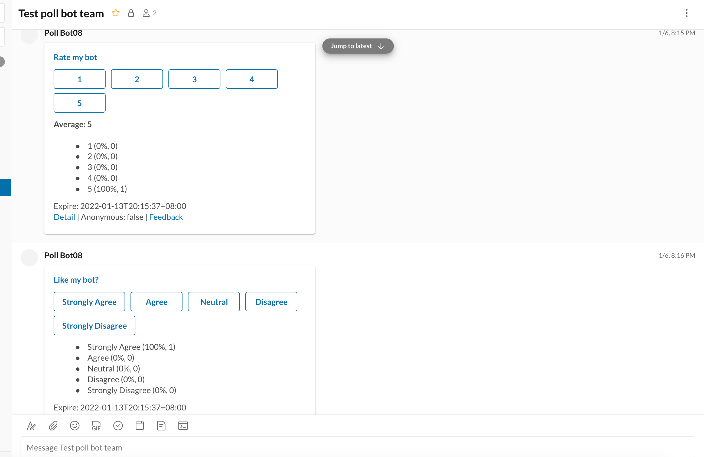
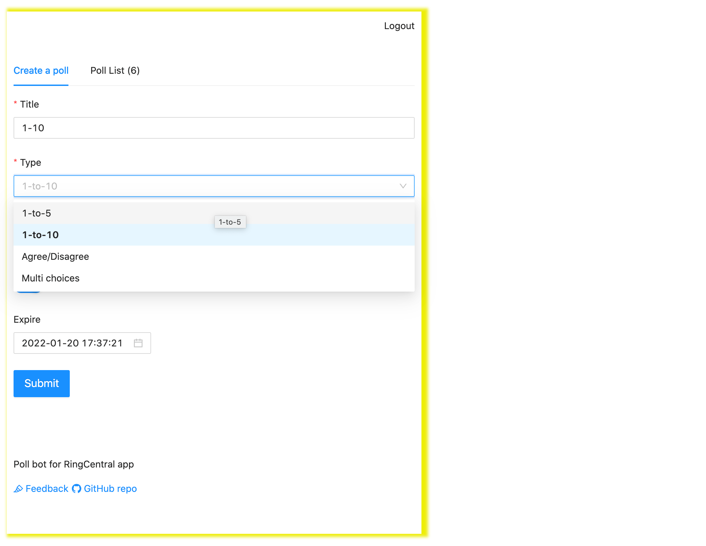

# Poll Bot for RingCentral App

A Poll bot using adaptive card and interactive messages of RingCentral app, created with [https://github.com/ringcentral/ringcentral-add-in-framework-js](https://github.com/ringcentral/ringcentral-add-in-framework-js)

## Use

Login to RingCentral app, install Poll bot from add-in list, add poll bot to team.

## Videos

- Poll bot preview video: https://youtu.be/kGPw8c4Bkd4

## Create polls from bot command

[Create polls from bot command](command.md)

## Screenshots

