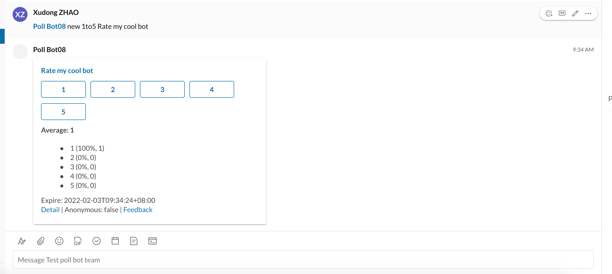

# Create polls from bot command

## Basic command

`@YourPollAddInName {cmd} {type} [anonymous=1] {title}`

## examples:

```
@YourPollAddInName add 1to5 Rate my app
@YourPollAddInName add 1to10 Rate my app
@YourPollAddInName add agree Love my app
@YourPollAddInName add agree anonymous=1 Love my app
```

* note: you can use `create`, `new`, or `-c` to replace `add`


